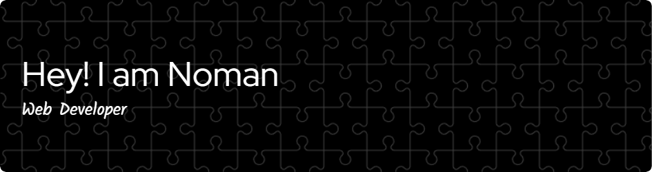

# 🌟 Abdullah Al Noman | Web Developer

## 👋 About Me

Hi! I'm Abdullah Al Noman, a passionate Web Developer with a knack for creating user-friendly and efficient applications. I enjoy learning new technologies and working on innovative projects.

## 🚀 What I'm Up To

- 🌱 I’m currently exploring **[Latest Technology, e.g., Next.js, Docker]**
- 💼 I’m working on **[Current Project Name, e.g., a tourism website]**
- 🔍 Open to **collaborations** and **exciting job opportunities**

---

## 🛠️ Tech Stack

### 🌐 Frontend  
  
  
  
  

### ⚙️ Backend  
  
  
  

### 🛠️ Tools  
  
  
  

---

## 🌍 Connect With Me

  

📍 **Location:** Dhaka, Bangladesh  
📧 **Email:** aalncse@gmail.com

---

## 📊 GitHub Stats

---

